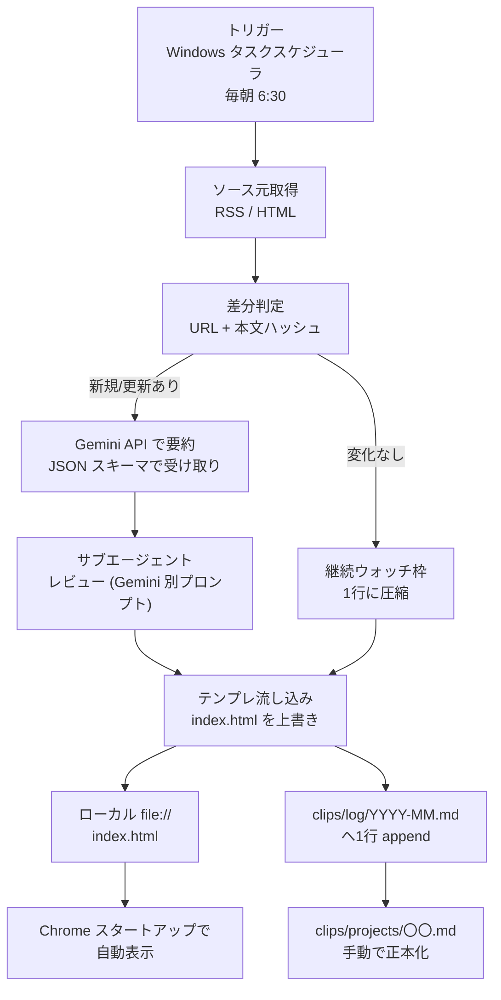

# 土木 Daily News — 設計ドキュメント

> 本ドキュメントの目的: 受講生仲間・同僚に、本ツールを**4パーツ（トリガー／ソース元／処理する場所／届ける先）**と**3つのコツ**で1回で説明できる状態にすること。実装前の設計メモ。

関連ファイル:
- 完成形の絵: [index.html](./index.html)
- クリップ運用: [clips/README.md](./clips/README.md)
- フォルダ全体の作業ルール: [AGENTS.md](./AGENTS.md)
- 要約スキル: [.claude/skills/daily-news-summarize/SKILL.md](./.claude/skills/daily-news-summarize/SKILL.md)
- レビュースキル: [.claude/skills/daily-news-review/SKILL.md](./.claude/skills/daily-news-review/SKILL.md)
- MVP手動試行の記録: [mvp-notes.md](./mvp-notes.md)

---

## 1. このツールの目的（課題仮説・解決仮説）

### 課題仮説
- 土木業界（国交省の公共工事中心）の管理職として、社外情報の体系的キャッチアップが**ほぼゼロ**になりがち。
- 追いきれない領域が重なることで、意思決定の前提となる「認知」が遅れる。
- 特に「国交省・規制」「i-Construction/自動運転/BIM・CIMなど建築・土木で横断する技術」「資材価格」は、知らないと判断ミスにつながる。

### 解決仮説
- 毎朝ブックマークから開けば、**3分で業界の動きを把握できる静的ページ**（朝刊型ダッシュボード）があれば、意思決定の前提情報が安定する。
- さらに、気になる記事は**Markdownでプロジェクトとして後追い**できれば、点の情報が線になって蓄積する。

### 自動化で達成したいこと / しないこと
- **したい**: 毎朝のソース取得・要約・整形・ローカルHTML更新、重複検出、ログ追記。
- **しない**（当面）: 完全自動のファクトチェック。プロジェクト正本（`clips/projects/`）の内容更新。公開ホスティング。

---

## 2. 全体フロー



---

## 3. 4パーツごとの設計

### 3-1. トリガー

| 項目 | 内容 |
|------|------|
| 採用 | **Windows タスクスケジューラ**（ローカル完結） |
| 頻度 | 平日毎朝 6:30。PCが起動していない日はスキップ（ログに残す） |
| 業務側トリガー | 自分がChromeを起動 → スタートアップページで自動的に当日分が表示される |
| なぜこれか | （1）APIキーがPCの外に出ない（2）Pages公開の権限管理が不要（3）講義4の「自作する意味」＝自分専用用途に最小コストで合致 |
| 移行先候補 | **GitHub Actions の cron**（クラウド処理化したくなった時）／Cursor Automations | 
| 将来移行に備えた設計 | 処理本体は `scripts/` のような独立フォルダに切る。ローカル実行もActions実行も同じスクリプトを呼ぶだけ、にしておく |

### 3-2. ソース元（確定版）

朝刊に載せる常設ソース。実URL・RSS有無の最終確認は次フェーズ（ソース元リサーチ）で行う。

| カテゴリ | 名称 | URL（想定） | RSS | robots.txt | 取得方法 | 備考 |
|---------|------|------------|-----|------------|---------|------|
| 行政（一次） | 国交省 報道発表 | `https://www.mlit.go.jp/report/press/` | 要確認 | 要確認 | HTML スクレイピング | 必須・必ず一次で照合 |
| 行政（一次） | 国交省 建設政策 | `https://www.mlit.go.jp/policy/construction/` | 要確認 | 要確認 | HTML | 政策トレンドの拾い漏れ対策 |
| 行政（一次） | 内閣府（骨太方針・国土強靭化・関連会議体） | `https://www.cao.go.jp/` 配下 | 要確認 | 要確認 | HTML | 更新頻度は低め。週次枠扱いも可 |
| 行政（一次） | 地方整備局（全国・報道発表のみ） | 各局サイト | 要確認 | 要確認 | HTML | 9局ほど。まず報道発表だけに絞る。記事が多すぎる場合はタグで重要度フィルタ |
| メディア（二次） | 日経クロステック 建設 | `https://xtech.nikkei.com/atcl/nxt/arc/business/15/` 付近 | 要確認 | 要確認 | RSS（ある場合） | 有料壁にぶつかる場合は「見出し＋リード」止まり |
| メディア（二次） | 建設通信新聞 | `https://www.kensetsunews.com/` | 要確認 | 要確認 | RSS / HTML | 日刊専門紙。有料比率高め |
| メディア（二次） | 日刊建設工業新聞 | `https://www.decn.co.jp/` | 要確認 | 要確認 | RSS / HTML | 同上 |

ソース運用ルール:
- **有料記事で本文が取れないものは、要約をAIに書かせない**（見出し+リード+リンクだけ載せる）。
- RSSがあるサイトはRSS優先。HTMLスクレイピングは最後の手段。
- 全国カバーは記事数が膨らむので、**朝刊は横断で重要度順に3〜5本**に圧縮。地域別の詳細は「今週の深掘り枠」または log 側に退避。

### 3-3. 処理する場所

ローカルPC上で Python もしくは Node のスクリプトが走る。AIは **Gemini API** を使う。

#### AI / コードの分担（講義3 コツ3）

| AIに任せる（Gemini） | コードに任せる |
|--------------------|---------------|
| 本文 → JSON（要約・論点バレット・タグ候補） | 日付・曜日・発行号数の埋め込み |
| 「今日の一言」候補の**提案** | URL正規化・本文ハッシュによる差分判定 |
| サブエージェントとしてのレビュー（別プロンプトで再度呼ぶ） | テンプレート（`index.html` の骨組み）への流し込み |
|  | ソース別の取得順・タイムアウト・リトライ |
|  | `clips/log/YYYY-MM.md` への1行 append |
|  | 許可タグリストのバリデーション |

#### Gemini 呼び出しの型（スキーマ v1.1）

- `response_mime_type: application/json` を指定し、必ず **JSONで受ける**。
- プロンプトに以下のスキーマを**そのまま貼る**（AIに文章整形をさせない）:

```json
{
  "title": "string (90文字以内)",
  "url": "string (httpで始まる)",
  "section": "国交省・規制・政策 | 技術・トレンド | 資材価格・コスト",
  "date": "YYYY-MM-DD",
  "is_in_scope": true,
  "maturity": "確定 | 提言 | 観測",
  "lead": "string (100文字前後の要約)",
  "bullets": ["string", "string", "string"],
  "tags": ["#国交省", "#i-Construction", "..."]
}
```

詳細ルールは [.claude/skills/daily-news-summarize/SKILL.md](./.claude/skills/daily-news-summarize/SKILL.md)。

- 受け取った後、コード側で:
  - 必須フィールド欠落チェック
  - `section` が定義済みの値か確認
  - `tags` が許可リスト（[AGENTS.md](./AGENTS.md)）内か確認
  - `maturity` が `確定|提言|観測` のいずれかか確認
  - `is_in_scope` が boolean か確認
  - `lead` や `bullets` が空でないか確認

### 3-4. 届ける先

| 区分 | 内容 |
|------|------|
| 宛先 | **ローカル `index.html`**（`C:\Users\MS3357\src\【課題】土木Daily-News\index.html`） |
| 表示動線 | Chrome スタートアップページに `file:///C:/Users/MS3357/src/%E3%80%90%E8%AA%B2%E9%A1%8C%E3%80%91%E5%9C%9F%E6%9C%A8Daily-News/index.html` を設定 |
| なぜ公開しないか | GitHub Pages は無料/Proプランでは**公開のみ**（プライベートリポジトリでもサイトは誰でも読める）。いまは自分だけで十分なので、ネット露出を作らない |
| スマホ閲覧 | **保留**。必要になったら Cloudflare Pages + Access など別途検討 |
| 副次出力 | `clips/log/YYYY-MM.md` への1行 append（振り返り用） |

---

## 4. 3つのコツを本ツールにどう生かすか

### コツ1 完成形の絵から作る
- [index.html](./index.html) を先に完成させ、セクション構成・密度・色使いを確定済み。
- AIの自由度が下がる代わりに、出力のブレが激減する（型にはめる運用が前提）。

### コツ2 専門家に磨かせる
- フロー中に**サブエージェントレビュー**を2本差し込む（Gemini 別プロンプト）:
  1. **内容レビュー**: 要約が原文を曲げていないか／論点が薄くないか。観点は [.claude/skills/daily-news-review/SKILL.md](./.claude/skills/daily-news-review/SKILL.md) に定義。
  2. **UI/UXレビュー**: 紙面密度、重要度に対する視線誘導、初期表示の読みやすさ。
- レビュー基準を**スキルmd化**しておくことで、AIモデルや呼び出し側を変えても観点が固定される。

### コツ3 ブレをコードで止める
- **チェック（バリデーション）**:
  - JSONスキーマの必須フィールド欠落なし。
  - `section` は定義値のみ。`tags` は許可リスト内。
  - 「今日の一言」は1件だけ選ばれているか。
- **型にはめる**:
  - [index.html](./index.html) をテンプレートとして固定。AI出力はJSONで受けてテンプレに差し込む。
- **余計な仕事を引き受ける**:
  - 日付・曜日・発行号数・並び順はコードで機械的に決定。
  - 差分判定・重複抑制もコード。AIは要約と論点だけに集中。

---

## 5. MVPとPOCの切り分け（講義4 対応）

講義4の「課題を分解 → 自作する意味 → MVP → POC」を本ツールに当てはめる。

### 5-1. 課題の分解
- 社外情報のキャッチアップを**毎朝3分で終わらせたい**（時間の上限）
- 対象は**土木中心・国交省メイン + 横断技術 + 資材価格**（領域の絞り）
- **自分1人**で使える範囲で十分（共有は不要）

### 5-2. 自作する意味
- 既存ニュースアプリでは**土木ドメインに絞り込めない**／**気になった記事をJSONで溜められない**。
- 既製ダッシュボードは**朝3分で読む用に密度調整できない**。
- よって、自作する意味がある（＝**作る価値がある**）。

### 5-3. MVP（仮説検証のための最小）
- **1ソースだけ**（国交省 報道発表）
- **要約は Gemini に1本ずつ投げるだけ**（バッチ最適化なし）
- **差分判定なし**（毎朝同じ3本を表示しても良い）
- **ログ追記なし**
- **目的**: 「朝この画面を開けば満足できるか」の検証。**品質より動線**。

### 5-4. POC（技術可否の小実験）
- **RSS / HTML スクレイピング**が実際に使えるか（robots.txt・認証の壁）
- **Gemini API が JSONで安定して返すか**（モデル・プロンプトの現実性）
- **Windows タスクスケジューラ登録 → 無人実行**が確実に走るか（起動時刻・権限・ログ）
- **Chromeスタートアップ → file:// で日本語パス**が問題ないか（URLエンコード）

MVPを**先**にローカルで1回手で動かし、後からPOCで「自動運転」させる、の順を想定。

---

## 6. セキュリティの前提

ローカル完結を選んだ時点で、リスクは大きく下がっている。残るのは3点。

### 6-1. APIキー（Gemini）
- **置き場所**: プロジェクト直下の `.env`（`.gitignore` 必須）。または Windows の環境変数。
- **禁じ手**: `index.html` / `design.md` / 公開予定のファイルに直書きしない。
- **コミット防止**: コミット前に `git diff` でキーの文字列が含まれていないか確認する癖をつける（将来CIで検査に昇格可）。

### 6-2. 公開範囲
- 本ツールは**ローカル前提**。GitHub Pages / Surge.sh / Netlify などには**公開しない**。
- 誤操作で公開されないよう、リポジトリを**プライベート**に維持する。
- `clips/projects/` は**絶対にpushしない**前提で扱う（将来Git管理するなら `.gitignore` で除外）。

### 6-3. スクレイピング規約
- 各ソースの `robots.txt` と**利用規約**を事前確認する。
- **RSSが提供されていればRSSを優先**、HTMLスクレイピングは最後の手段。
- アクセス間隔を空け、`User-Agent` に問い合わせ先を明示する。
- 有料コンテンツ本文は取得しない（見出し＋リード＋リンクまで）。

---

## 7. 「毎日新規ニュースを量産しない」実装方針

- ソースごとに `{url, 本文ハッシュ, 最終取得日時}` を `clips/log/YYYY-MM.md`（または別の軽い状態ファイル）に残す。
- 同一URL＋同一ハッシュなら**朝刊面からは省略**、もしくは「継続ウォッチ」欄に1行だけ残す。
- 指標・物価系は**数値差分があるときだけ詳報**、変化が軽微な週は1行サマリーに圧縮。
- 同トピックの新着が連続する場合は、直近N件だけ残し古いものは log 側にだけ残す。

---

## 8. SSOTとデータ保管

| 置き場 | 役割 | 更新主体 |
|--------|------|----------|
| `clips/log/YYYY-MM.md` | 取り込みログ（append-only） | 自動ジョブ |
| `clips/inbox.md` | 手動メモの仮置き | 自分 |
| `clips/projects/〇〇.md` | テーマごとの正本（要約の集約・更新） | 自分 |

- **原則**: 同じ記事の全文を何度も複製しない。
- ログは「いつ何が流れてきたか」の時系列、正本は「このテーマについて今わかっていること」。
- 自動で書き込むのは log だけ。projects は自分が育てる場所。

---

## 9. 
### 今日の一言 選定ルール（2026-04-27 確定）

#### 基本方針
その日の記事の中から**管理職が最も意思決定・行動に直結する1本**を選ぶ。
「面白い」ではなく「明日の仕事に影響する」を選定軸とする。

#### 実装方式：Geminiに選ばせる（Option A・推奨）
その日の全記事JSONを渡し、以下のプロンプトで1本選ばせる。

> 「以下の記事の中から、土木建設業の管理職が明日の意思決定に最も直結する1本を選び、
> その記事のURLと50文字以内の選定理由を返してください。」

将来スコアルールが必要になった場合の優先順位（Option B）:
1. `maturity: 確定` を `提言` より優先
2. `is_in_scope: true` を優先
3. ソースが国交省・官公庁 ＞ 業界紙
4. 全国・業界横断 ＞ 地域・個社

#### フォールバック
- 記事が1本のみ → 自動的にその記事を選ぶ
- 記事が0本 → 「今日の一言」欄は非表示（エラー扱いにしない）

#### 実装メモ
- 選定プロンプトは `daily-news-summarize` スキルとは独立した
  `daily-news-pick` スキルとして将来切り出す想定
- コード側への接続は `index.html` 自動差し込み実装時にセットで行う

### 発表日フォールバックルール（2026-04-27 確定）

#### 基本方針
発表日が本文から取れない場合でも、記事を捨てずに取得日で代替する。

#### 取得順序
1. HTML の `<meta>` タグ または `<time>` タグから取得（優先）
2. URL パターンから推定（例: `houdou202602.html` → `2026-02`）
3. 上記いずれも取れない場合 → 取得日を `date` に入れ、
   `lead` の末尾に `（発表日不明のため取得日で代替）` と明記する

#### コード側の実装メモ
- 日付抽出は `summarize_one.py` の前処理として実装する
- Gemini には `published_at` として渡す（スキーマ変更なし）

---

### 本文薄い記事・PDF中心記事の扱い（2026-04-27 確定）

#### 判定基準
本文が **300文字未満** の場合を「本文薄い」と判定する。

#### 方針
- `bullets` を最大 **1件** に絞る
- bullets の末尾に `（詳細は別添PDF参照）` を明記する
- PDF本文の取得は**当面やらない**（コスト・複雑度が高い）
- `lead` は取得できたリード文のみで構成し、推測で膨らませない

#### コード側の実装メモ
- 本文文字数のカウントは HTML タグ除去後の文字数で判定する
- `summarize_one.py` の前処理で `body_length` を計算し、
  Gemini へのプロンプトに `本文文字数: N文字` として渡す
- Gemini 側は SKILL.md の禁則（推測で膨らませない）で対応済み


未決事項・次アクション

| 区分 | 内容 | 次に決めるタイミング |
|------|------|---------------------|
| ソース元 | 各URLのRSS有無・robots.txt・更新頻度を1枚表にまとめて確定 | 次フェーズ（リサーチ） |
| タスクスケジューラ | 登録手順・失敗通知（メール？ローカル通知？）・祝日扱い | MVP動作直前 |
| スクレイピング規約 | 有料メディアのリンク掲載が規約上問題ないかの最終確認 | MVP着手前 |
| APIキー | `.env` テンプレ（`.env.example`）の作成 | スクリプト実装着手時 |
| スマホ閲覧 | 本当に要るか。要るなら Cloudflare Pages + Access | 必要になったら |
| index.html のデータ属性正規化 | `data-clip-section="技術・トレンド（横断）"` を `"技術・トレンド"` に揃える（3箇所）。UIの「（建築・土木共通）」表記は見出しで維持 | **完了**（2026-04-26） |
| 発表日の抽出ルール | 本文に日付がない報道発表の扱い（URL/meta から推定・無理なら取得日で代替） | [mvp-notes.md](./mvp-notes.md) 気づき1 参照 |


---

## 付録：自分の言葉で説明できるようにするチェックリスト

- [x] このツールが解決したい**課題仮説**を1文で言える。
  > 「土木建設業の管理職が毎朝3分で業界動向を把握できる個人用朝刊ダッシュボードを、
  > AIと自動化で量産コストゼロに近い形で運用する。」

- [x] **4パーツ**（Windowsタスクスケジューラ／確定ソース6本／Gemini＋コード分担／ローカルHTML＋Chromeスタートアップ）を口頭で言える。
  > 「毎朝スケジューラがスクリプトを起動し、国交省などの確定ソースから記事を取得。
  > GeminiがJSONに要約し、コードがHTMLに差し込む。
  > 朝、Chromeを開くと完成した朝刊が表示される。」

- [x] **3つのコツ**を自分のプロジェクトにどう生かしているか、一言で説明できる。
  > 「完成形のHTMLを先に作り（コツ1）、スキーマでAIの出力を固め（コツ2）、
  > POCで1本回してから設計を詰めた（コツ3）。」

- [x] 「毎日同じ話を量産しない」ために、**コードが何をやるか**を説明できる。
  > 「URLと本文のハッシュで差分判定し、既出記事はスキップする。
  > 継続ウォッチ記事は圧縮して別枠で管理する。」

- [x] `clips/log` と `clips/projects` の**役割の違い**を説明できる。
  > 「logは自動ジョブがappend-onlyで書く時系列の一次受け。
  > projectsは自分がテーマごとに育てる正本で、自動では触らない。」

- [x] **MVPとPOCの違い**と、どちらから先に手を付けるかを説明できる。
  > 「POCはスキーマとAPIが動くか確かめる最小実験。
  > MVPは手動でも一連の流れが回る最小の完成形。
  > POCで技術的な不確実性を潰してからMVPを作る順番にした。」

- [x] **APIキーをどこに置くか**、**なぜ公開しないか**を説明できる。
  > 「`.env`にキーを書き、`.gitignore`で除外する。
  > リポジトリをpublicにするとキーが流出してAPI費用が発生するため、
  > privateに設定した上でキーはコードに直書きしない。」

---

### 1. エージェントとサブエージェントの分担

| 役割 | 担当 | スキル/ファイル |
|------|------|----------------|
| **メインエージェント** | 要約JSON生成 | `summarize_one.py` ＋ `daily-news-summarize SKILL.md` |
| **サブエージェント** | 要約結果のレビュー・修正提案 | `daily-news-review SKILL.md` |
| **将来サブエージェント** | 「今日の一言」選定 | `daily-news-pick`スキル（未実装） |

**分ける理由：**
- 要約とレビューを同じプロンプトに混ぜると、自分の出力を自分でチェックするバイアスが生まれる
- 役割を分けることで、観点の独立性が保たれ、品質が上がる
- パイプラインとして `ok / revise / reject` の判定で分岐できる

---

### 2. 自動化の4要素

**（a）トリガー**
- Windowsタスクスケジューラが毎朝6:30に`run-daily.cmd`を起動
- 心拍ログで「起動できたか」を記録（失敗検知の土台）
- ポイント：トリガーはシンプルに。複雑なロジックはスクリプト側に持たせる

**（b）ソース元**
- 国交省報道発表（一次ソース・無料・静的HTML）→ 最優先
- 日経クロステック建設RSS・日刊建設工業新聞RSS（二次ソース）
- ポイント：robots.txtを必ず確認。有料壁は見出し＋リードまで。Claude系ボット禁止サイトはPythonスクリプト経由のみ

**（c）処理する場所**
- すべてローカルPC上で完結（公開ホスティングなし）
- 本文取得→キーワードフィルタ→Gemini API要約→バリデーションの順
- ポイント：AIにやらせる範囲を明確に絞る（AGENTS.mdで定義）。日付・URL正規化・重複判定はコード側の仕事

**（d）届ける先**
- `clips/log/YYYY-MM.md`：自動ジョブのappend-onlyログ（現状の終点）
- `index.html`：Chromeスタートアップページ（手動テンプレ。自動差し込みは次フェーズ）
- ポイント：ログとUIを分離することで、自動化が途中で止まっても手動で補える

---

### 3. 設計で意識したこと

- **完成形を先に作る**：index.htmlを最初に手動で作り、「目指すゴール」を可視化した
- **スキーマで出力を固める**：GeminiへのプロンプトにJSONスキーマを渡し、出力の揺れを防ぐ
- **POCで不確実性を潰してから自動化**：1本手動で回してスキーマの頑健性を確認してから実装した
- **禁則をAGENTS.mdに集約**：「有料記事の本文を推測で埋めない」などの制約を一か所にまとめ、AIも人も同じルールで動く
